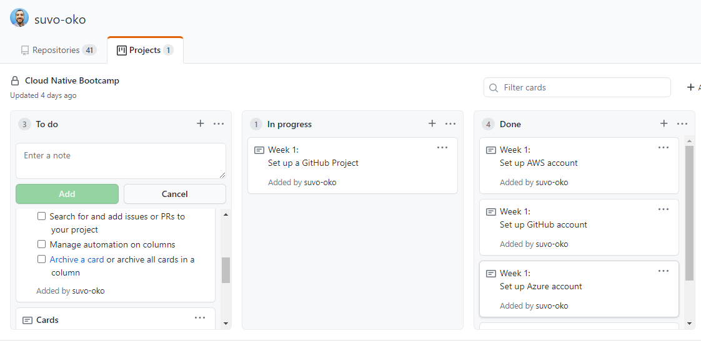

# Setting Up Projects in GitHub

In this project, we'll set up a new project in GitHub.

I created a project called Cloud Native Bootcamp and populated it with cards relating to this week's projects. One card for each project. Task **completed**

Further reading: [Managing Project Boards](https://docs.github.com/en/github/managing-your-work-on-github/managing-project-boards)

  

