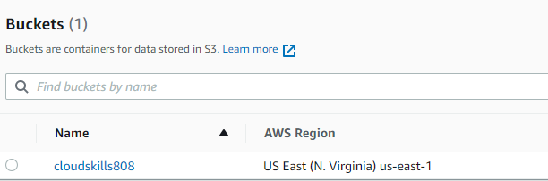

# Reusable and Clean Python Code

## Introduction

- We'll use the AWS Boto3 library to deploy a resource to AWS.
- We should strive to write clean and reusable code.

## Install Boto3

- Boto3 is the name of the Python SDK for AWS. It allows you to directly create, update and delete AWS resources from your Python scripts.
- How to install Boto3: From the command line, run `pip install boto3`.
- The function, when run, will create an S3 bucket in AWS.
- To authenticate to AWS:
  - From the command line, run `aws configure`.
  - I was prompted to enter the following information, obtained from my AWS Console: *Access Key ID*, *Secret Access Key*, *AWS Region*, and *Output Format*.
  - For the default region, I chose *eu-west-3*, but this resulted in an error when I ran the script.
  - Apparently, the *CreateBucket* operation isn't allowed in all regions. The S3 Bucket will default to *us-east-1* if you don't specify the region.
  - I ran `aws configure` again and changed the default region to *us-east-1*. After this change, the script worked and the bucket was created correctly.
- The final code can be found [here](Project2/s3bucket.py).
- There's the option, as pointed out in the forum, to specify the region in the script itself.
- To run the code and create the S3 Bucket: from the command line, run `python s3bucket.py cloudskills808`, where *cloudskills808* is the name of the bucket to be created.

This is the final result, with the S3 Bucket already up and running in AWS.

