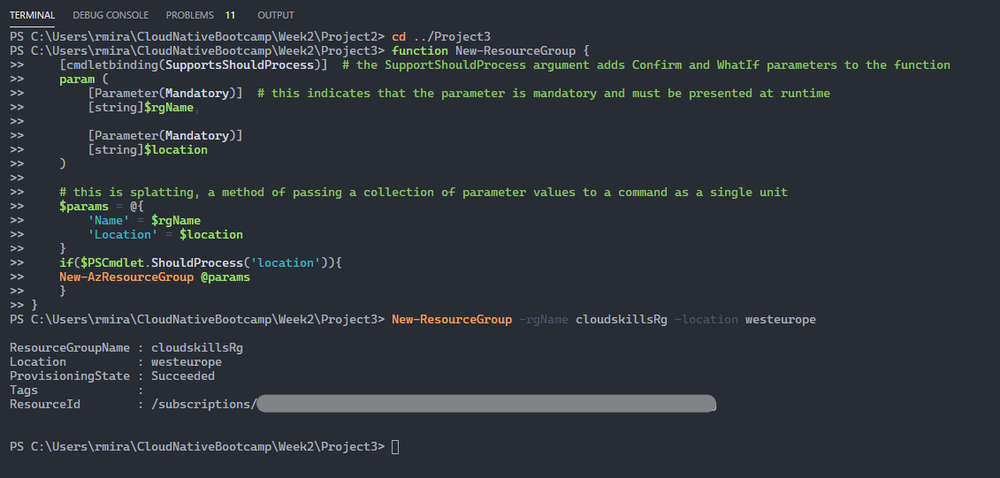

# Reusable and Clean PowerShell Code

- When writing a script, try to make sure you give the user of the script the option to pass in parameters (date, location, mandatory parameters, etc.).
- Make the script reusable by using a function.
- Run the script named [New-ResourceGroup.ps1](Project3/New-ResourceGroup.ps1)
- Then, from the command line, run `New-ResourceGroup -rgName cloudskillsrg -location westeurope` (remember these two parameters are mandatory).
- The result can be seen below

