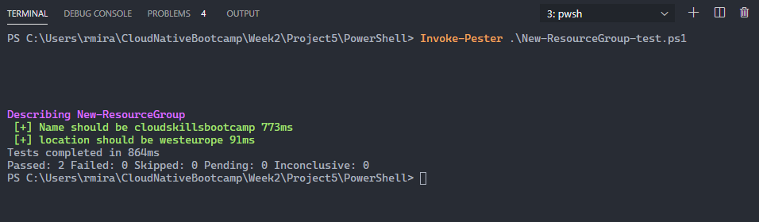
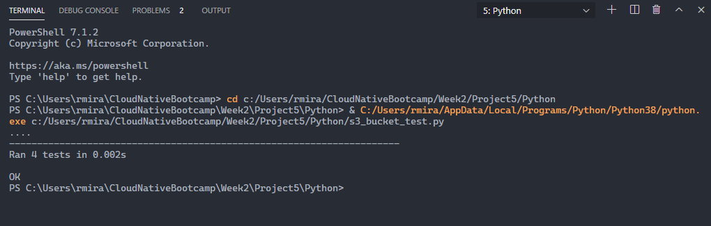

# Testing in PowerShell and Python

- For these labs, we'll use unit testing.
- Unit testing is a type of software testing where individual units, or components, of a software are tested. The purpose is to validate that each unit of the software code performs as expected. Unit Testing is done during the development (coding phase) of an application by the developers. Unit Tests isolate a section of code and verify its correctness. A unit may be an individual function, method, procedure, module, or object.

## PowerShell

- For the PowerShell code, we'll use Pester, a test framework.
- For more information on Pester: [What Is Pester and Why Whould I Care?](https://devblogs.microsoft.com/scripting/what-is-pester-and-why-should-i-care/#:~:text=Pester%20is%20a%20test%20framework,tests%20and%20report%20the%20results.)
- A book on Pester: [The Pester Book](https://leanpub.com/pesterbook) by Adam Bertram.
- The result:

## Python

- For the Python code, we will use the **unittest** library.
- More information on testing in Python: [Getting Started with Testing in Python](https://realpython.com/python-testing/)
- The code can be found [here](Project5/Python/s3_bucket_test.py)
- The result:

