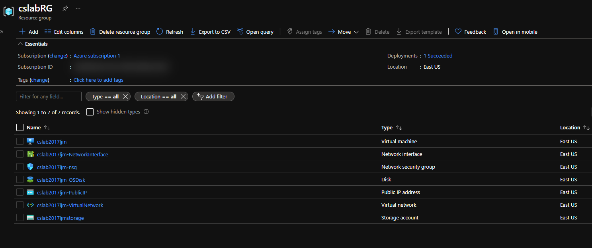

# Building an ARM Template for Virtual Machine Deployment in Azure

In this lab, Luke Orellana guides us on how to deploy an Ubuntu virtual machine to Azure using ARM templates.

- Luke instructs us, as a first step, to install the [Azure Resource Manage (ARM) Tools](https://marketplace.visualstudio.com/items?itemName=msazurermtools.azurerm-vscode-tools) extension for VS Code.
- There is, however, a very powerful pack that comes with 11 extensions for Azure, including the ARM Tools. It is called [Azure Tools](https://marketplace.visualstudio.com/items?itemName=ms-vscode.vscode-node-azure-pack). This is a highly recommended extension, as it comes with most of the major Azure tools you are going to need.
- We then need to install the Azure CLI. The Azure CLI is a set of commands used to create and manage Azure resources.
- The current version of the AzureCLI, as of this writing, is **2.19.1**.
- For instructions on how to install the Azure CLI, go to [this page](https://docs.microsoft.com/en-us/cli/azure/install-azure-cli).

## Azure Resource Manager (ARM)

- ARM is the deployment and management service for Azure.
- When a user sends a request from any of the Azure tools, APIs, or SDKs, Azure Resource Manager receives the request, authenticates and authorizes it.
- All requests are handled through the same API.

### ARM Templates

- ARM templates are JavaScript Object Notation (JSON) files that define the infrastructure and configuration for your deployments.
- It uses a *declarative syntax* (it outlines what resources will look like, without describing its control flow).
- In an ARM template, you specify the resources and the properties for those resources, and *Azure Resource Manager* uses this information to deploy the resources in an organized and consistent manner.
- ARM templates are *idempotent* which means you can deploy the same template many times and get the same resource types in the same state.
- ARM template files are made up of the following elements:
  - **schema**: A required section that defines the location of the JSON schema file that describes the structure of JSON data.
  - **contentVersion**: A required section that defines the version of your template. The version (1.0.0.0) hasn't changed since ARM templates are in GA.
  - **apiProfile**: An optional section that defines a collection of API versions for resource types.
  - **parameters**: An optional section where you define values that are provided during deployment. These values can be provided by a parameter file, by command-line parameters, or in the Azure portal.
  - **variables**: An optional section where you define values that are used to simplify template language expressions.
  - **functions**: An optional section where you can define user-defined functions that are available within the template. User-defined functions can simplify your template when complicated expressions are used repeatedly in your template.
  - **resources**: A required section that defines the actual items you want to deploy or update in a resource group or a subscription.
  - **output**: An optional section where you specify the values that will be returned at the end of the deployment.

## Deployment

- To connect to Azure CLI, from the command line, run `az login`.
- To run the template, we first need to have a resource group created.
- To create a new Resource Group, run `az group create --name ResourceGroupName --location ResourceGroupLocation`
- The command to deploy the template is `az deployment group create --resource-group ResourceGroupName --template-file .\template.json -p adminPassword="Password"`
- In my case, I ran `az deployment group create --resource-group cslabRG --template-file .\template.json -p adminPassword="Pa55w.rd1234"`.
- If you're running PowerShell, then the command would be `New-AzResourceGroupDeployment`.
- The final JSON file can be seen [here](Project1/template.json).
- This is the result, shown in the Portal.

- Just after that, I deleted the resource group by running `az group delete --name cslabRG`.
