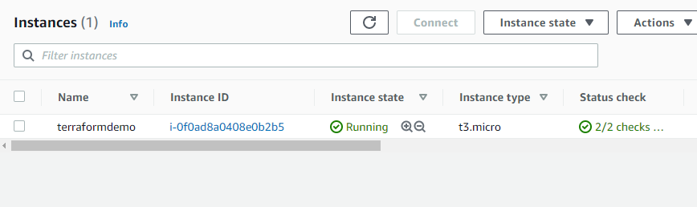
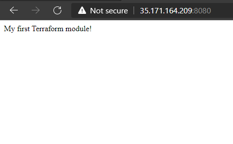

# Building a Terraform Module To Create a Virtual Network in AWS

## Terraform

- [Terraform](https://www.terraform.io/) is an infrastructure-as-code tool, much like ARM templates.
- Terraform is platform agnostic, meaning it can be used with most of the major cloud platforms.
- Terraform is written in Go.
- To run Terraform, the location of the Terraform executable file must be added to the system's Path variable.
- The Terraform extension for VS Code should also be installed.
- Providers are the tools used by Terraform to talk to the different platforms. For this lab, Terraform will use the [AWS provider](https://registry.terraform.io/providers/hashicorp/aws/latest/docs).

## The lab

- For this lab, we'll deploy an AWS EC2 Instance using Terraform.
- We'll use a module, where all the configuration data will reside. Modules can be reused for different deployments.
- This is the finished module, named [main.tf](Project2/modules/ec2/main.tf).
- We'll also create a [variables.tf](Project2/modules/ec2/variables.tf) file, which will hold our variables, that will serve as parameters for our Terraform module, allowing aspects of the module to be customized without altering the module's own source code, and allowing modules to be shared between different configurations.
- The las step is to create the main Terraform file. This file will call upon the Terraform module (see above), that contains the actual configuration. This file is also called [main.tf](Project2/main.tf)
- After all the files are created and save, we'll connect to AWS by running `aws configure` from the command line.
- We then run `terraform init`. This command will initialize our Terraform directory and download the provider (AWS in this case). This command will create the **.terraform** folder, that contains the AWS provider executable file.
- The second step is to run `terraform plan`. It will display an execution plan. This will show the resources that are going to be created, without actually deploying them to the live environment.
- The last step is to run `terraform apply`. This command will also display the execution plan. To perform the actions shown in the execution plan, we need to type **yes**.
- I ran all these commands successfully, but I couldn't see the EC2 instance in my AWS console. This was because my region was defined as *us-east-2*, and the instance was deployed to the *us-east-1* region. I had to change it in the upper right corner of the console.
- Here are the final results. The EC2 instance running in the console, and the page displaying **My first Terraform module!**

- After that, I tore down the resources, by running `terraform destroy`.
