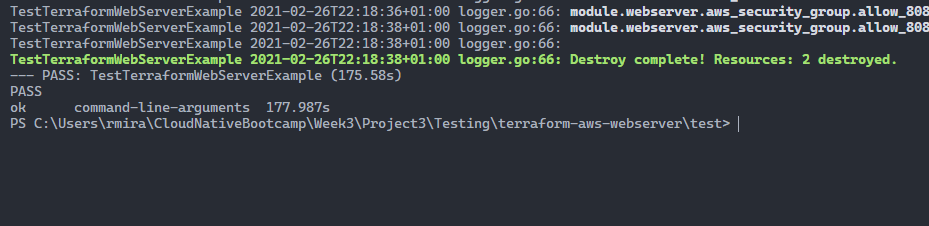

# Testing Infrastructure As Code

- [Gruntwork](https://gruntwork.io/) develop a testing tool to test Terraform code called [Terratest](https://terratest.gruntwork.io/).
- Terratest is a Go library.
- To install Go, go to the [Go website](https://golang.org/).

## The lab

- For this lab, we're going to test the Terraform files we used in the previous project to deploy the EC2 instance.
- The Terraform community has standardized the naming scheme for folders containing Terraform modules, as follows: **terraform-provider-module**.
- In our case, the folder is called **terraform-aws-webserver**.
- In order to use Terraform modules that are in Git repositories, the modules need to follow these naming conventions.
- We need to make a few changes to the *main.tf* file to make it more dynamic and reusable.
  - We'll replace the *region* and *servername* parameters with variables, so it can be used with different values for region and servername.
  - We'll change the *source* parameter to point to the location of the files in this file structure.
- We then create a *variables.tf* file to declare the variables. This is my [variables.tf](Project3/Testing/terraform-aws-webserver/examples/webserver/variables.tf) file.
- We now create a file called *outputs.tf*, to validate that the website is created. The test will do so by verifying the public IP address.
- This is my [outputs.tf](Project3/Testing/terraform-aws-webserver/examples/webserver/outputs.tf) file.
- This is the [Go file](Project3/Testing/terraform-aws-webserver/test/webserver_test.go), used for the test.
- This test will run a `terraform init`, followed by a `terraform apply`. After both are finished, the test will end with a `terraform destroy`.
- The test will also verify if the deployed webserver is running correctly.
- We now need to download the libraries used in the code, with the command `go get -t -v`.
- I encountered an error in this step. The command couldn't find the main module.
- I fixed this error by running `go env -w GO111MODULE=auto`, with the help of Andrew Dawson, from the community.
- Before running the test, make sure to authenticate to AWS by running `aws configure`.
- The command to run the test is `go test -v webserver_test.go`.
- The test passed, and this is the result.

## Conclusion

This was the most challenging project until now. I found the Go language challenging.
