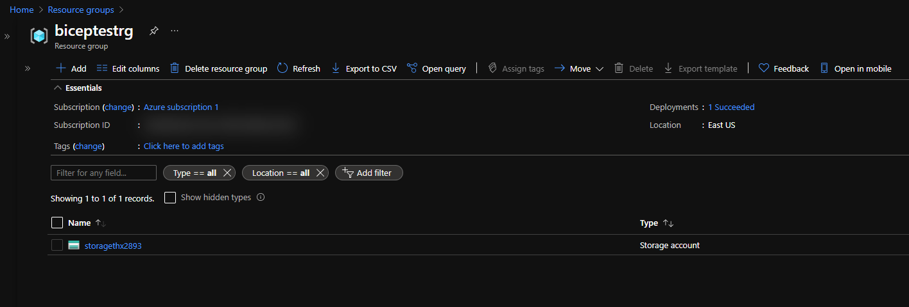

# Introduction to Azure Bicep :muscle:

- Azure Bicep is a declarative Domain Specific Language (DSL) for deploying Azure resources.
- It uses a more friendly and easier syntax than the JSON syntax of ARM templates.
- Azure Bicep works as an abstraction layer built on top of ARM Templates. Anything that can be done with Azure ARM Templates can be done with Azure Bicep as it provides a “transparent abstraction” over ARM (Azure Resource Manager).
- Azure Bicep is a compiled/transpiled language. This means that the Azure Bicep code is converted into ARM Template code. Then, the resulting ARM Template code is used to deploy the Azure resources.
- [Azure Bicep GitHub page](https://github.com/Azure/bicep).
- [Azure Bicep VS Code extension](https://marketplace.visualstudio.com/items?itemName=ms-azuretools.vscode-bicep).

## The Lab

For this lab, we'll deploy a storage account using Bicep.

- First steps:
  - Install the [Bicep CLI](https://github.com/Azure/bicep/blob/main/docs/installing.md).
  - Install the [Bicep VS Code extension](https://marketplace.visualstudio.com/items?itemName=ms-azuretools.vscode-bicep).
- We then create a new file called **main.bicep**.
- From the terminal we run the command `bicep build main.bicep`.
- This action will create a new file called **main.json**, which is the skeleton of an ARM template.
- We then start editing the **main.bicep** file with the code to create a storage account.
- Once the file is saved, we run `bicep build main.bicep` again and the data will be compiled into the **main.json** file.
- The **main.json**, which is the ARM template, is going to be the file we will use to deploy the resources to Azure.
- First, we connect to our Azure account by running `az login`.
- We then have to create a resource group or use an existing one. I created a new one called biceptestrg, with the following command: `az group create --name biceptestrg --location eastus`.
- To deploy the resource, I used the following command: `az deployment group create --resource-group biceptestrg --template-file .\main.json -p name="storagethx2893"`.
- This is the resourge group with the storage account, as seen in the portal:

- Afterwards, I ran `az group delete --name biceptestrg` to delete the resource group.

## Conclusion

Bicep is still in its infancy, and still being developed. As of the time when this lab was taken, just over 3,800 had installed the VS Code extension. However, I believe this tool will grow and be popular. Mostly because of its ease of use, and the excellent VS Code extension, with an intellisense feature that is very good. It makes our lives a lot easier. With a few lines of code, we can deploy complex infrastructures. It still has limitations, but from what I understand, Microsoft is investing heavily in this tool.

