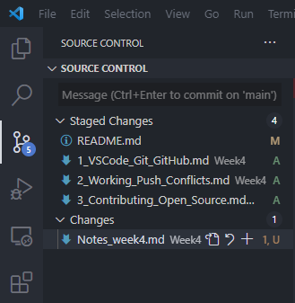
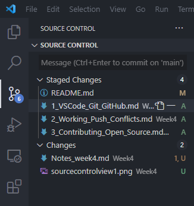
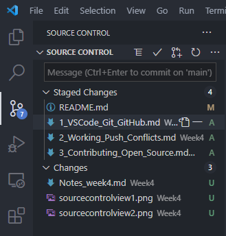
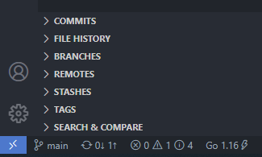

# VS Code with Git and GitHub

- VS Code provides tight source-control integration with Git by default.
- VS Code provides many visual cues, helpful prompts, and shortcuts to common Git features, available from the Command Palette, the Status Bar, and the Source Control view.
- From the Source Control view, you can access many Git features, like clone, push, pull, and commit.

## The Lab

For this lab, we'll use VS Code to commit and push code to a GitHub repository.

1. Create a new file inside Week1 folder, called [cloudskills_git_project.md](Project1/cloudskills_git_project.md).
2. Save the file, commit it and push it to the GitHub repository.
3. I'll go ahead and do the same with this file right here, and the other ones still pending to stage and commit (see pictures).
4. When you click on the Version Control icon on the left, under **Changes** you can see the files that changed but still haven't been staged. You can click on the plus (+) sign next to the filename to stage it (it's the equivalent of `git add`). The files will go to the **Staged Changes**. Once in the Staged Changes, you can click on the minus (-) sign to unstage the file. It will move back to the Changes section (the equivalent of `git reset`).
5. To commit the changes, click on the tick icon, on the top menu of the Source Control view.
6. To push the changes to the remote repository, click on the synchronize changes icon (two clockwise arrows) in the Status Bar. This action will execute a pull and a push. To the right of the synchronize changes icon, you can see two arrows, one pointing downward (the pull) and one pointing upward (the push). In this case, there's nothing to pull and there's one change to be pushed.

