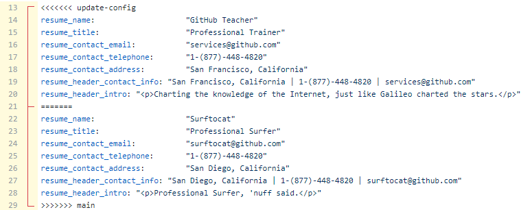
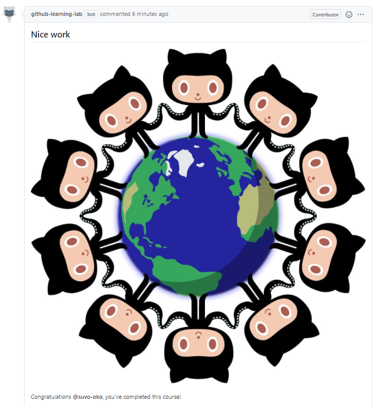

# Managing Merge Conflicts

For this project, I took the [Managing Merge Conflicts](https://lab.github.com/githubtraining/managing-merge-conflicts) learning module. Here, I'll describe the steps I took to resolve the merge conflicts presented in the lesson.

## Step 1

- In this scenario, two colleagues are working in their own branches, made changes to the same lines of the same file, and opened pull requests. One pull request was merged to the main branch, but the second pull request has a conflict.
- GitHub detects this conflict and warns the maintainer with the message **This branch has conflicts that must be resolved**.
- Git highlights the content that is in conflict by placing the lines to be verified between the `<<<<<<< update-config` and `>>>>>>> main` markers. The two different sections are separated by the `=======` marker.

- Once the conflict is resolved, we can go ahead and merge the pull request and delete the branch.

## Step 2

- There will be cases where there are several conflicts in a single file, or different conflicting files.
- As the maintainer of the repo, we need to verify the files and resolve all conflicts, to be able to commit the merge.

## Step 3

- In this step, we'll create our own conflict, by altering the contents of a file.
- After editing the file and committing the change, we see the the message that the branch has conflicts that must be resolved. We edit the file by removing the conflicting part and click on the **Mark as resolved** button.

