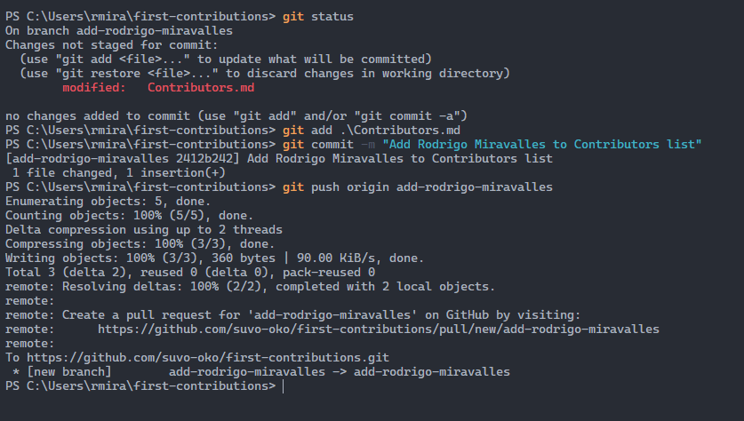
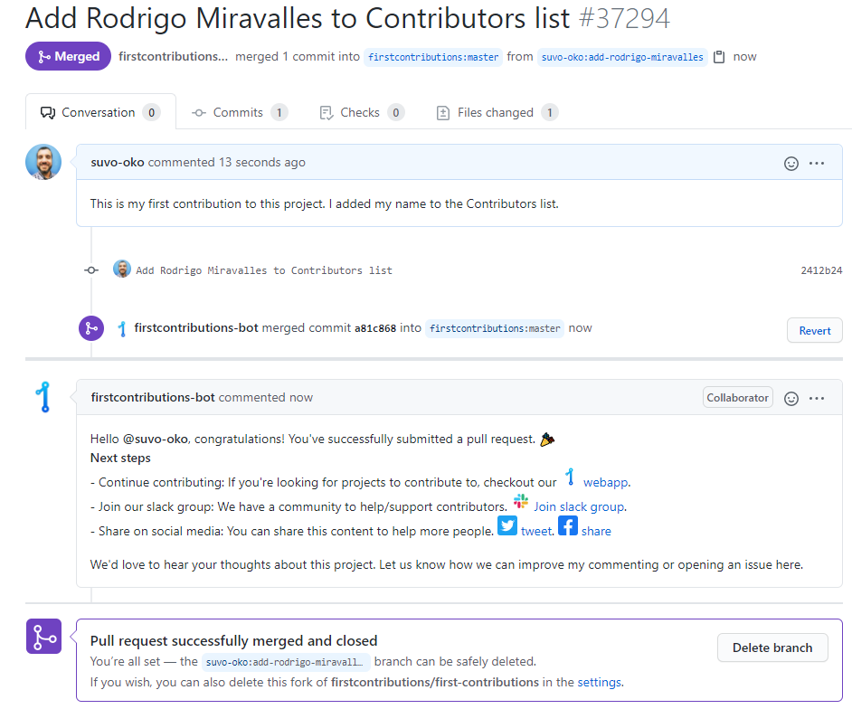

# My First Contribution

For my first contribution to an open source project, I decided to take the [First Contributions](https://github.com/firstcontributions/first-contributions) tutorial. In this tutorial, we add our own name to a file and then open a pull request, to merge the change to the main repo.

1. The first step is to fork the repo to our own GitHub account.
2. We then clone the repo to our local machine, using the `git clone https://github.com/suvo-oko/first-contributions.git`.
3. We move into the newly created *first-contributions* directory by typing `cd first-contributions`.
4. We now create a new branch with the command `git checkout -b add-rodrigo-miravalles`. The *git checkout* switches branches and the *-b* flag creates a new branch. From now on, we're going to be working in this branch.
5. We are going to add our name to the *Contributors.md* file and save it.
6. We now add the file to the staging area with the command `git add Contributors.md`.
7. To commit the changes, we run `git commit -m "Add Rodrigo Miravalles to Contributors list"`.
8. To push the changes to the remote repo, we run `git push origin add-rodrigo-miravalles`, where *add-rodrigo-miravalles* is the name of the working branch.
9. To submit the changes for review, we go to our GitHub repo and click on the button **Compare and pull request**.
10. We add a title and a message and click on **Create pull request**.

