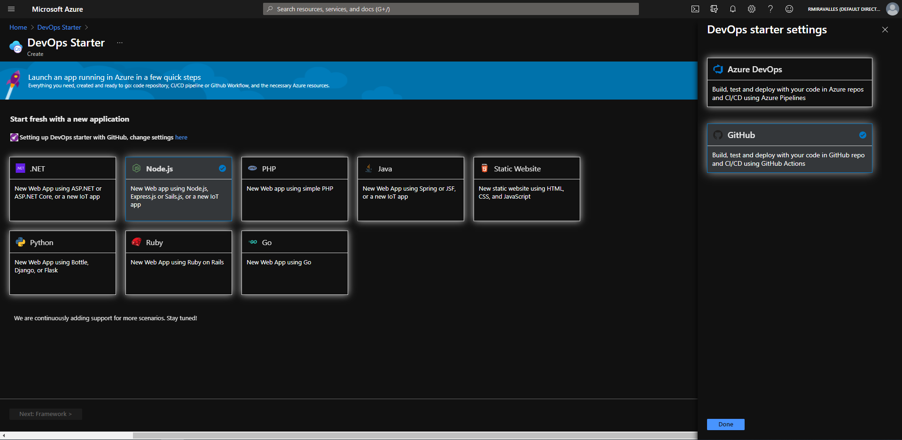
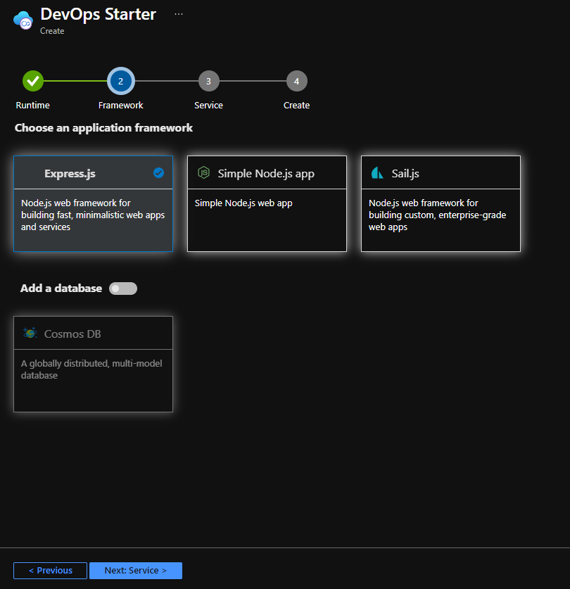
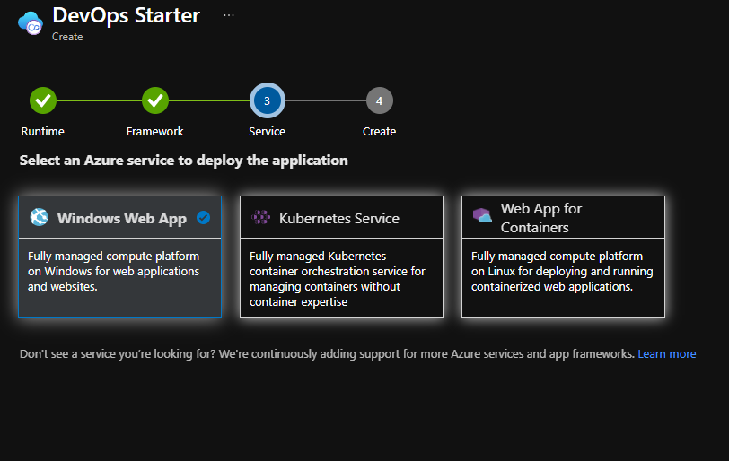
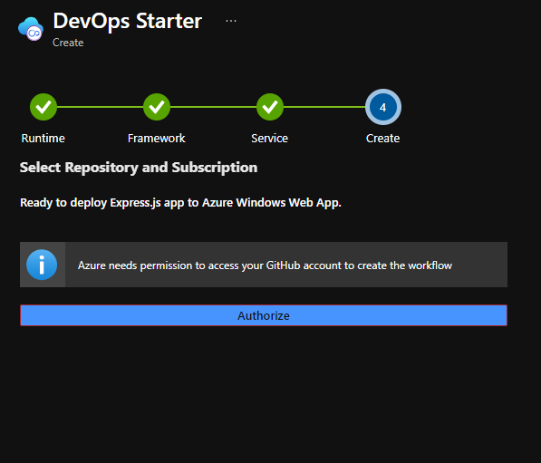
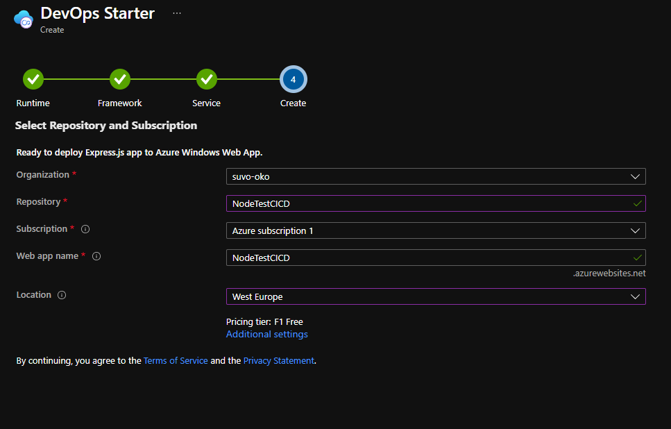
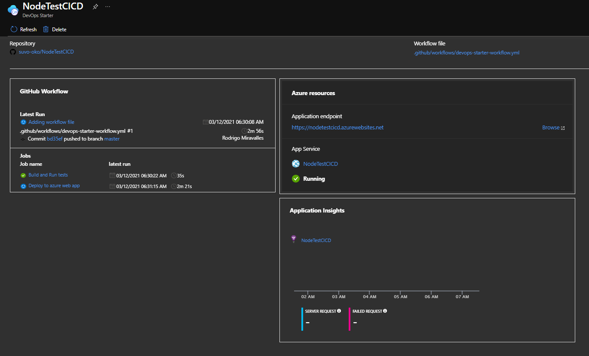
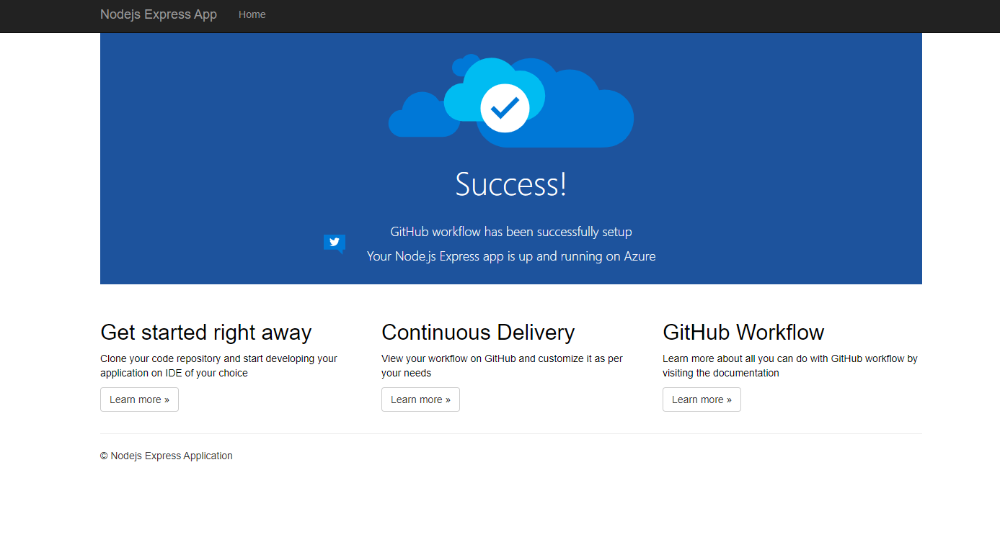
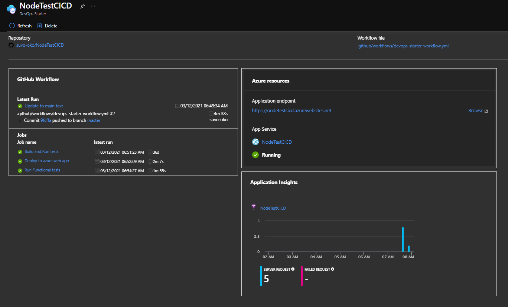
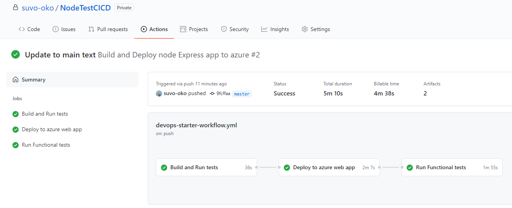
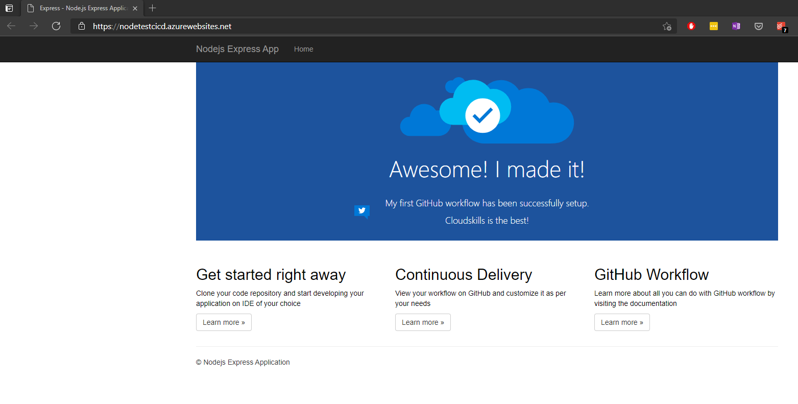

# Deploying a Web App via GitHub Actions

## What is GitHub Actions?

- See my [First GitHub Action](../Week1/5_First_GitHub_Action.md) document from Week 1 for a quick overview of GitHub Actions.

## The Project

- For this project, we'll use Azure [DevOps Starter](https://docs.microsoft.com/en-us/azure/devops-project/) feature.
- DevOps Starter is an easy and quick way to get started with CI/CD in Azure.
- DevOps Starter automates the setup of an entire continuous integration (CI) and continuous delivery (CD) for your application to Azure.
- DevOps Starter does all the work for the initial configuration of a DevOps pipeline including everything from setting up the initial Git repository, configuring the CI/CD pipeline, creating an Application Insights resource for monitoring, and providing a single view of the entire solution with the creation of a DevOps Starter dashboard in the Azure portal.
- You can choose between using Azure DevOps or GitHub Actions. For this project, we'll use GitHub Actions.
- In the video, Luke deploys a .Net application. I followed his instructions, but then I tried this lab a second time, and I deployed a Node.js app. This is the one depicted here.

### Creating the DevOps Starter resource

- In the Azure Portal, we'll click on *Create a resource* and search for DevOps Starter. We click on *Create*.
- The first step is to choose the language of our application. As mentioned above, I chose *Node.js*.

- We then select the framework.

- The third step is to select the service in which the app will be deployed. In my case, I had the option to choose between *Windows Web App*, *Kubernetes Service* or *Web App for Containers*. I chose *Windows Web App*.

- We need to authorize Azure to access our GitHub account. The next step is to create the repo and give our app a name.
 
- Once the resource is created, we'll have access to a nice dashboard, where we can see important information about our app.

- Our app is up and running!

### CI/CD Pipeline

- We'll now see the CI/CD pipeline in action.
- Whenever new code is pushed to the repository's master branch, it will trigger the GitHub Action.
- The Action will build the artifact (the finished and packaged application), run tests, deploy the app to Azure App Service, and run functional tests.
- The DevOps Starter creation process created a new GitHub repository in my account. To test the CI/CD workflow, I cloned the repo to my local machine, made a change to the file, and pushed the new code back to the master branch.
- This new push to the repo appears in the DevOps Starter dashboard.

- In the GitHub repository, in the Actions tab, we can see the action concluded successfully.

- And the new app is running!

