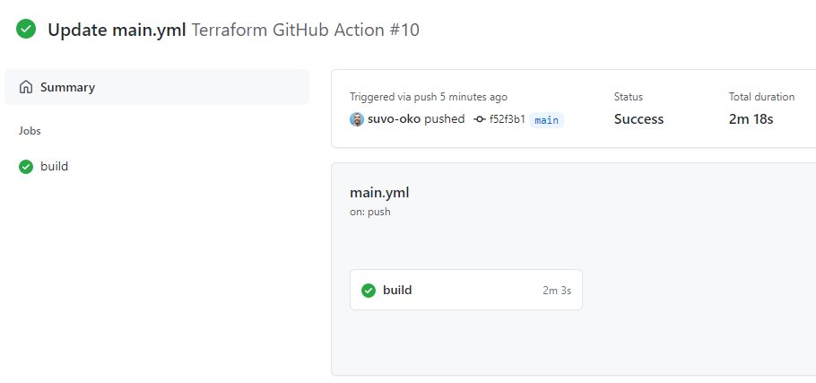

# Terraform with GitHub Actions

- In this lab, we're going to deploy infrastructure to Azure with Terraform using GitHub Actions. Every time we modify the infrastructure and push a change to the main branch, the action is triggered and the infrastructure is deployed.
- Terraform has to authenticate with Azure to be able to communicate. The best practice to deploy to Azure is to use Service Principals, and not your own Azure user account.
- The command to create a Service Principal with the contributor role is the following: `az ad sp create-for-rbac --name ServicePrincipalName  --role contributor --scopes /subscriptions/subscriptionid`
- The output of this command is a JSON object, and it looks like this:

```json
{
  "appId": "xxxxxxxx-xxxx-xxxx-xxxx-xxxxxxxxxxxx",
  "displayName": "TerraformSP",
  "name": "http://TerraformSP",
  "password": "xxxxxxxxxxxxxxxxx",
  "tenant": "xxxxxxxx-xxxx-xxxx-xxxx-xxxxxxxxxxxx"
}
```

- We're going to use this information, and the subscription ID, to create a secret in our GitHub repository.
- As we may already be aware, we shouldn't write sensitive information directly in our code stored in GitHub. GitHub has a feature called Secrets that let us safely store passwords, credentials and other sensitive information.
- We're going to store a secret called `AZURE_CREDENTIALS` in our secrets vault. This is going to be used by the [Azure Login GitHub Action](https://github.com/marketplace/actions/azure-login) to access Azure CLI.
- The format taken by the secret isn't exactly the same as the output from the `az ad sp create-for-rbac` command. This is the format I used:

```json
{
  "clientId": "xxxxxxxx-xxxx-xxxx-xxxx-xxxxxxxxxxxx",
  "clientSecret": "xxxxxxxxxxxxxxxxx",
  "subscriptionId": "xxxxxxxx-xxxx-xxxx-xxxx-xxxxxxxxxxxx",
  "tenantId": "xxxxxxxx-xxxx-xxxx-xxxx-xxxxxxxxxxxx"
}
```

- Terraform needs to connect to Azure, and therefore it also needs to be able to read the Azure credentials. We need to store these credentials in our code in environment variables that Terraform will recognize. That's how I did it:

```yaml
env:
     ARM_SUBSCRIPTION_ID: ${{ secrets.ARM_SUBSCRIPTION_ID }}
     ARM_TENANT_ID: ${{ secrets.ARM_TENANT_ID }}
     ARM_CLIENT_ID: ${{ secrets.ARM_CLIENT_ID }}
     ARM_CLIENT_SECRET: ${{ secrets.ARM_CLIENT_SECRET }}
     AZURE_STORAGE: 'terraform67ui3078'
```

- These are secrets stored in the repo's secrets vault. The AZURE_STORAGE variable will be used later in our code.

## The tasks

When our build starts, it will do the following:

```yaml
steps:
    
    - uses: actions/checkout@v2
      
    - name: Azure Login
      uses: Azure/login@v1
      with:
         creds: ${{ secrets.AZURE_CREDENTIALS }}
```

- The first step will checkout our repo so the job can access it.
- After that, the *Azure Login* action starts. This action logs us in to Azure CLI, so we can run commands.

```yaml
 
    - name: Build a Terraform state
      run: chmod +x ./tfstate.sh && ./tfstate.sh ${{ env.AZURE_STORAGE }}
        
    - name: HashiCorp - Setup Terraform
      uses: hashicorp/setup-terraform@v1.2.1
      
    - name: Terrafrom init
      run: terraform init -backend-config="storage_account_name=${{ env.AZURE_STORAGE }}"
      
    - name: Terraform plan
      run: terraform plan -out=tfplan
      
    - name: Terraform apply
      run: terraform apply tfplan
```

- The *Build a Terraform state* step will run the `tfstate.sh` script. This script will create a storage account to store our Terraform State file.
- The next task installs Terraform in our environment.
- To complete the action, the workflow will run `terraform init`, `terraform plan`, and `terraform apply`.

After several attempts, the build succeded!


## Conclusion

- I struggled with the yaml formatting, namely the indentation. The GitHub interface indicates a few formatting errors with squiggly lines, but it lacks more power, like intellisense or autocomplete. VS Code has a few extensions but I have to investigate further whether they're a good alternative.
- It took me some time to nail down the formatting for the AZURE_CREDENTIALS secret, but in the end I figured it out.
- In the video, Luke writes the environment variables with the Azure credentials directly in the code, but I used the secrets instead.
- It's very important to read the error messages thoroughly. They pack a lot of information about the errors.
- This is [my repository](https://github.com/suvo-oko/terraform-ghactions) for this project.
  