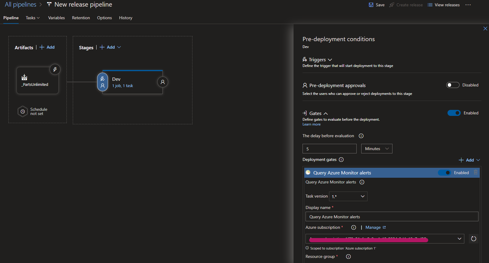

# Setting Up Continuous Monitoring

## Definition

The objective of a continuous monitoring program is to determine if the complete set of planned, required, and deployed security controls within an information system or inherited by the system continue to be effective over time in light of the inevitable changes that occur.

## The Project

- For this project I'll be using an existing CI/CD pipeline, from a previous lab.
- I built a pipeline in Azure DevOps following the instructions from the [Configuring CI/CD Pipelines as Code with YAML in Azure DevOps](https://azuredevopslabs.com/labs/azuredevops/yaml/) hands-on lab.
- Under *Pipelines*, and then *Releases*, we're gonna click on **New release pipeline**.
- I selected the **Azure App Service deployment** for template, since that what I was doing with the pipeline.
- After saving the stage, I went to **Pre-deployment conditions** (the set of icons on the left side of the stage rectangle) and added the [Query Azure Monitor alerts](https://docs.microsoft.com/en-us/azure/devops/pipelines/tasks/utility/azure-monitor?view=azure-devops) gate to the condition.

- More on gates: [Release deployment control using gates](https://docs.microsoft.com/en-us/azure/devops/pipelines/release/approvals/gates?view=azure-devops).
