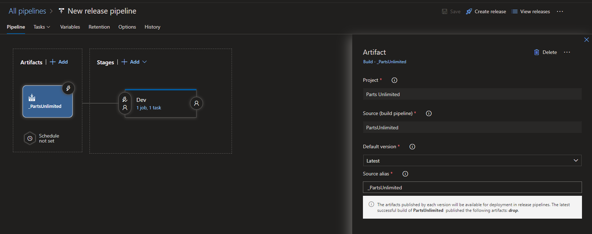

# Artifacts and Packages in CI/CD

- An artifact is a package of code.

## The Project

- For this project, I built an artifact from the code used in the previous lab, the Parts Unlimited web app.
.