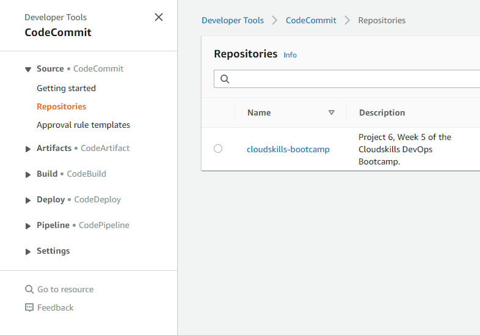

# Working with AWS CodeDeploy

- AWS has a number of different processes for CI/CD.
- [CodeCommit](https://aws.amazon.com/codecommit/) is a fully-managed source control service that hosts secure Git-based repositories.
- [CodeArtifact](https://aws.amazon.com/codeartifact/) is a fully managed artifact repository service that makes it easy to securely store, publish, and share software packages.
- [CodeBuild](https://aws.amazon.com/codebuild/) is a fully managed continuous integration service that compiles source code, run tests, and produces software packages that are ready to deploy. This is pretty much the CI process.
- [CodeDeploy](https://aws.amazon.com/codedeploy/) is a deployment service that automates application deployments to Amazon EC2 instances, on-premises instances, serverless Lambda functions, or Amazon ECS services.
- [CodePipeline](https://aws.amazon.com/codepipeline/) is a fully managed continuous delivery service that helps you automate your release pipelines for fast and reliable application and infrastructure updates.

## The Project

- For this project, we'll create a new repository in CodeCommit, and we'll store some code in there.
- CodeCommit works much like GitHub. We can create files directly from the repository page, we can clone the repo, etc.

