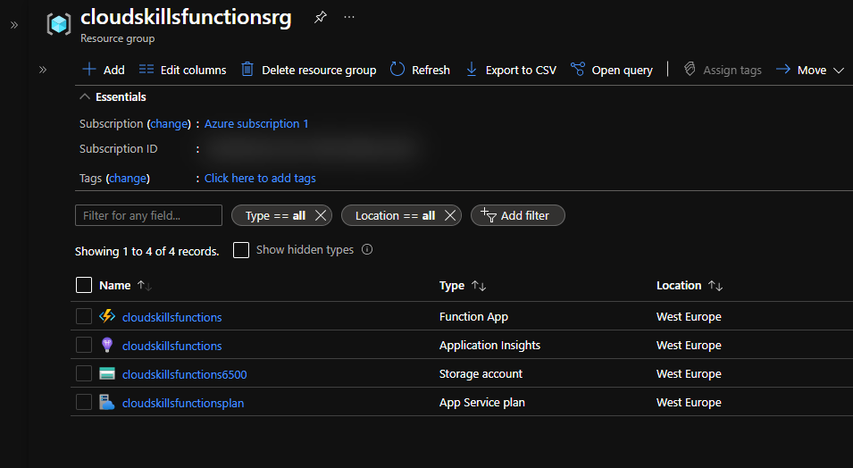
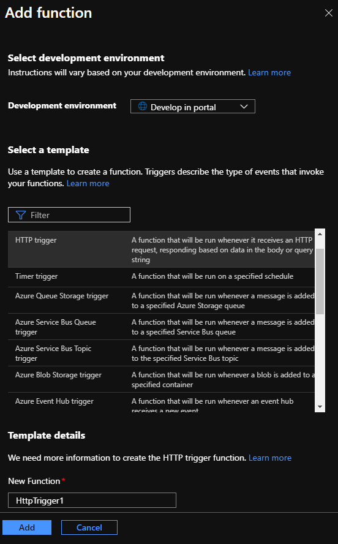
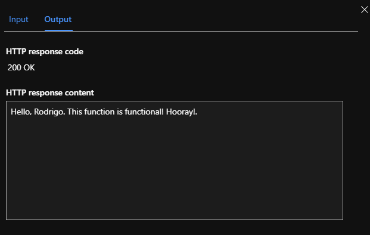

# Build an Azure Function App

In this project, we'll create an Azure Function using PowerShell.

## The Project

- First, we'll create our PowerShell file, that contains a function that will run commands to create our Azure Function.
- This is my PowerShell file: [createfunctionapp.ps1](Project1/createfunctionapp.ps1).
- In this file, I added the `az group create` command to create the resource group.
- When the file is complete, we select all its content (ctrl+A), right-click and select **Run selection** (or F8 in VS Code). This will load the function into memory.
- Now, from the terminal, I ran `Create-FunctionApp -RGName 'cloudskillsfunctionsrg' -name 'cloudskillsfunctions' -storageAccountName 'cloudskillsfunctions6500'` to create the resources in Azure using our PowerShell function. `RGName`, `name`, and `storageAccountName` are the mandatory parameters, as defined in the `param` block of the function. These parameters are to be passed at runtime.
- After this action is completed, we can see the resources in the Azure Portal.

- Now, from the Azure Portal, we're gonna go ahead and create our function.
- In our Function resource, we go to the **Functions** section, and click on the first item, **Functions**. We then click on **+Add** to add a new function. We'll use the **HTTP Trigger** template. This function will run whenever it receives an HTTP request.
- This is the **Add function** window:

- To test our function, we'll go to the newly created function and, under the **Developer** section, we'll go to **Code + Test**. Here, we can see our function's code, which is a PowerShell script.
- On the upper menu, we click on **Test/Run** to test our function.
- This is the result of the test.

