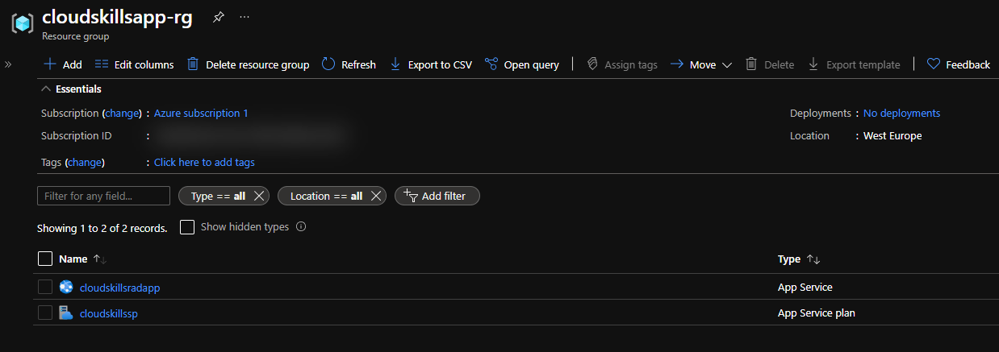
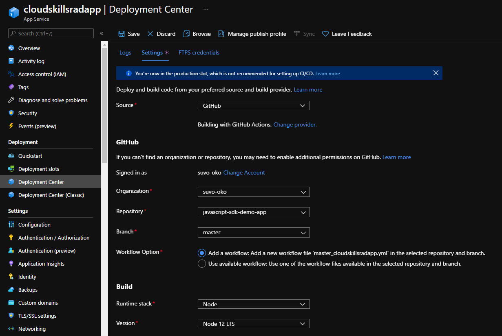
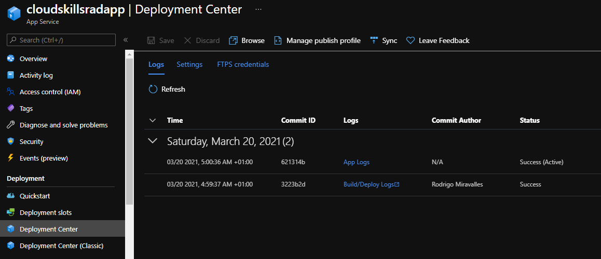
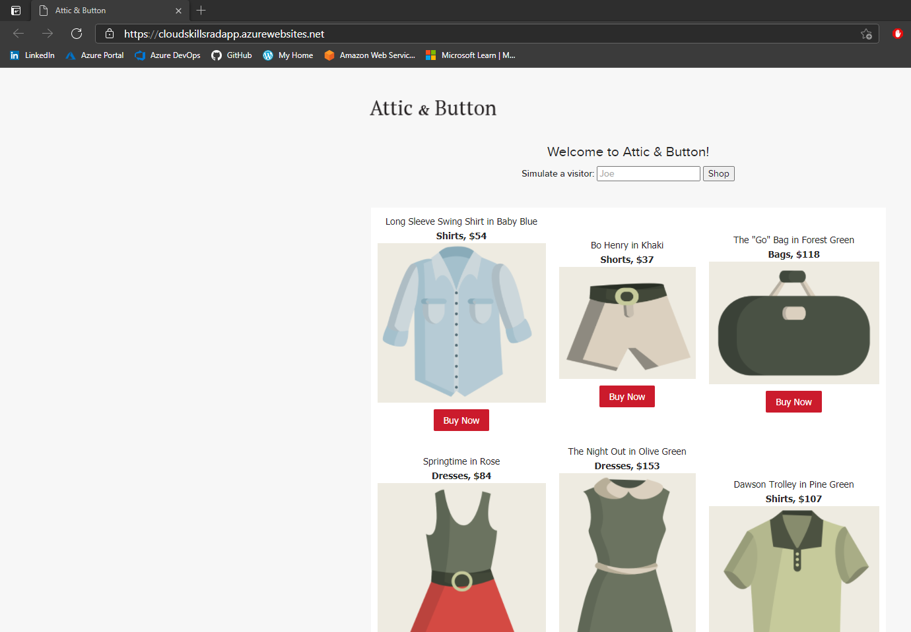

# Build an Azure Web App

For this project, we'll deploy an Azure App Service, with its corresponding App Service Plan, using Terraform. Then we'll deploy an app using the Deployment Center feature in the App Service page in the Portal.

## The Project

- First, we'll create the Terraform file, which will contain the resources to be deployed.
- This is my [main.tf](Project2/main.tf) file.
- In the video, Michael didn't include in his file the creation of the resource group. I included it. As you can see from my file, the first resource is a resource group.
- Two other files accompany the main.tf: [variables.tf](Project2/variables.tf) and `terraform.tfvars`.
  - `variables.tf` is where we define the variables we'll use throughout our configuration file.
  - `terraform.tfvars` is the file where we actually specify the values for the variables.
- This is my `variables.tf`:

```terraform
variable "app_service_plan_name" {
  type = string
}

variable "location" {
  type = string
}

variable "resource_group_name" {
  type = string
}

variable "app_service_name" {
  type = string
}
```

- And this is my `terraform.tfvars`:

```terraform
app_service_plan_name = "cloudskillssp"
location              = "westeurope"
resource_group_name   = "cloudskillsapp-rg"
app_service_name      = "cloudskillsradapp"
```

- The `terraform.tfvars` file is usually included in the `.gitignore` file, so it wouldn't normally be in source control. This file is likely to contain sensitive and confidential information, such as passwords and credentials.
- To execute the configuration, we first need to make sure we're in the same directory as the `main.tf`.
- We then run `terraform init` to initialize the working directory. This is the first command that should be run after writing a new Terraform configuration.
- The second command we run is `terraform plan`. This will create an execution plan. This command is a convenient way to check whether the execution plan for a set of changes matches your expectations without making any changes to real resources or to the state.
- The third command is `terraform apply` and this one will actually apply the changes required to reach the desired state described in the configuration file.
- After running these commands, we can see the resources are now present.

- The next step is to deploy our app to App Service. For this, we'll use the Deployment Center feature. Deployment Center offers a quick and easy way to implement CI/CD.
- The UX we see on the video is different than the one I used. I found this new experience interesting because it's streamlined in a single page. It also automatically creates a GitHub Actions workflow.

- We'll deploy a JavaScript sample app, which I forked from Michael's GitHub repo.This is [my repository](https://github.com/suvo-oko/javascript-sdk-demo-app).
- My GitHub account was already authorized in the Azure Portal, so I immediately saw my organization and my repositories.
- For **Workflow Option**, if you select **Add a workflow**, Azure will automatically create a GitHub Action for you. This is a great feature!
- When you click on save, you'll be taken to the **Logs** tab, where you can see the progress of the current commit, and the previous commits.
- After a considerable had passed, the build and deploy succeeded!

- And this is the app running.

- After confirming everything is working, I ran `terraform destroy` to tear down the resources we built.
