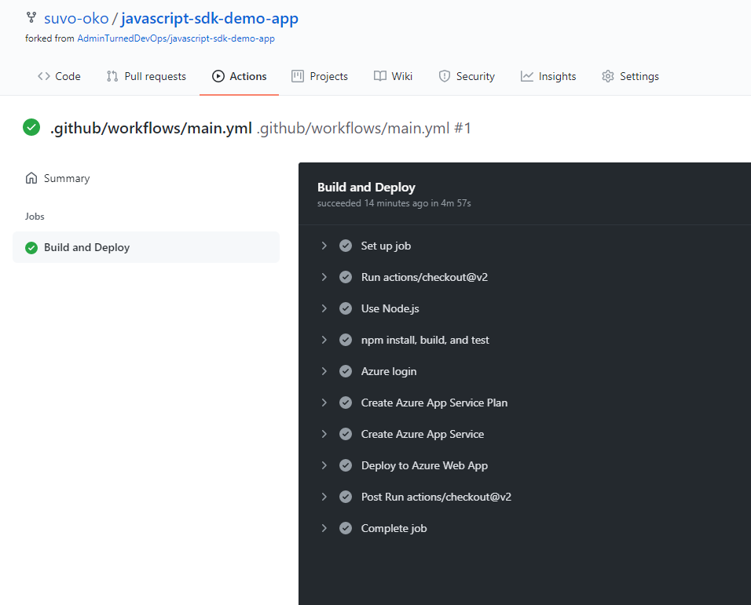

# Deploy an Azure Web App via CI/CD in GitHub Actions

For this lab, we'll build and deploy the same web app we used in the previous lab, but this time using GitHub Actions.

## The Project

- The [repository is here](https://github.com/suvo-oko/javascript-sdk-demo-app).
- In our repository, we click on the **Actions** tab to create our new workflow.
- There's a ready made workflow called [Deploy Node.js to Azure Web App](https://github.com/actions/starter-workflows/blob/ab8c670fafe65faf1574245c8fd327fae319d88f/ci/azure.yml), which can be useful, but for this lab we'll create a workflow from scratch.
- This workflow will build the Node.js app and deploy it to Azure App Service. The build and deploy jobs are contained in the same workflow.
- The first thing I did was store the **AZURE_CREDENTIALS** secret in the repository's secrets vault.
- I created a new service principal for this task with the following command: `az ad sp create-for-rbac --name radwebapp --role contributor --scopes /subscriptions/xxxxxxxx-xxxx-xxxx-xxxx-xxxxxxxxxxxx`.
- For more information on Azure service principals and GitHub secrets, please see [Project 3 from Week 5](../Week5/3_Terraform_GitHubActions.md).

### The workflow yaml file

Let's break down the workflow file.

```yaml
on: workflow_dispatch

env:
  AZURE_WEBAPP_PACKAGE_PATH: '.'
  NODE_VERSION: '12.x'
  RESOURCE_GROUP_NAME: 'radnodeapp'
  APP_SERVICE_PLAN: 'radnodeappsp'
  APP_SERVICE: 'radnodeapp'
```

- Here, we specify what will trigger the action. In this case `workflow_dispatch` means this action will be triggered manually, by clicking the **Run workflow** button.
- The `env` block holds our environment variables.

```yaml
jobs:
  build-and-deploy:
    name: Build and Deploy
    runs-on: ubuntu-latest

    steps:
    - uses: actions/checkout@v2

    - name: Use Node.js
      uses: actions/setup-node@v1
      with:
        node-version: '12.13.0'
    
    - name: npm install, build, and test
      run: |
        npm install
        npm run build --if-present
        npm run test --if-present
```

- This workflow has just one job, called **Build and Deploy**. What comes afterwards are the different steps to be executed.
- This workflow will run in a container running Ubuntu provided by GitHub.
- The first action will be to checkout our code, so the runner can work on it.
- Next comes Node.js setup, followed by npm commands.

```yaml
- name: Azure login
      uses: Azure/login@v1
      with:
        creds: ${{ secrets.AZURE_CREDENTIALS }}
    
    - name: Create Azure App Service Plan
      uses: Azure/cli@1.0.4
      with:
        inlineScript: az appservice plan create -g ${{ env.RESOURCE_GROUP_NAME }} -n ${{ env.APP_SERVICE_PLAN}} --is-linux
    
    - name: Create Azure App Service
      uses: Azure/cli@1.0.4
      with:
        inlineScript: az webapp create -g ${{ env.RESOURCE_GROUP_NAME }} -p ${{ env.APP_SERVICE_PLAN}} -n ${{ env.APP_SERVICE }} --runtime "NODE|12-lts"
```

- Here, we'll execute the **Azure login** action. This logs the runner in the Azure CLI, so it can execute commands. To log in to Azure, the runner will fetch the credentials in the repository's secrets vault.
- We then run the Azure CLI commands to create an App Service Plan and an App Service.

```yaml
- name: 'Deploy to Azure Web App'
      uses: Azure/webapps-deploy@v2
      with:
        app-name: ${{ env.APP_SERVICE}}
        package: ${{ env.AZURE_WEBAPP_PACKAGE_PATH }}
```

- This last step will deploy our web app to Azure using the **webapps-deploy** action.
- We now commit the code and we're ready to run the workflow.
- Since we defined the trigger to **workflow dispatch**, we need to go to the Actions tab, select our workflow, and click on **Run workflow**.
- The workflow is complete, with green checkmarks!


- And these are the newly created resources seen in the Azure Portal.


- And our web app up and running!

