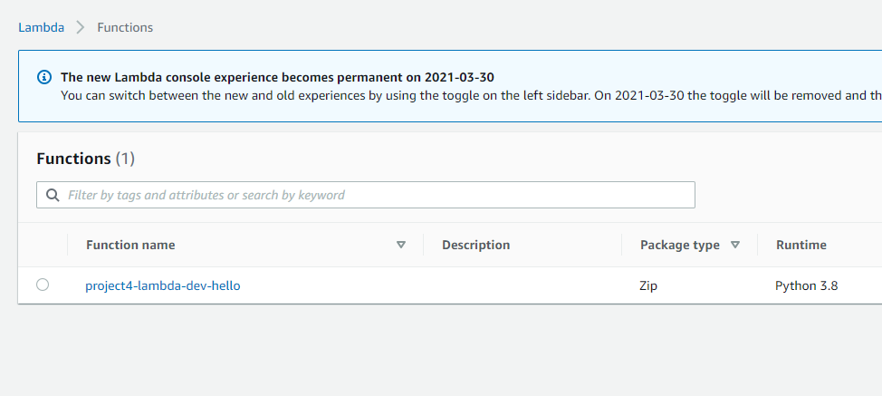

# Create a Lambda Function

[AWS Lambda](https://aws.amazon.com/lambda/) is the most popular serverless offering from AWS. Like other serverless compute services, AWS Lambda lets you run code without provisioning or managing servers, creating workload-aware cluster scaling logic, maintaining event integrations, or managing runtimes.

For this project we'll be using the [Serverless](https://www.serverless.com/) framework to deploy a Lambda function. Serverless is an open-source web framework that allows you to easily deploy your code to different *function as a service* providers. Originally, the framework was designed to work with AWS Lambda. Now it supports other providers, such as Azure, with Azure Functions.

## The Project 

- The first step is to install Serverless. We can do it either with NPM or Chocolatey.
- I installed Serverless using Chocolatey by running `choco install serverless`.
- If you want to install it with NPM, first you need to install NPM, which you can get [from here](https://www.npmjs.com/get-npm).
- Then, from the terminal, run `npm install -g serverless`.
- After Serverless is correctly installed, I ran `serverless create --template aws-python3` to create the boilerplate files. Make sure you are in the right directory. This command will create a Lambda function template with Boto3.
- This command will create 2 files in the directory you ran it: [handler.py](Project4/handler.py) and [serverless.yml](Project4/serverless.yml).
- The command to deploy the function is `serverless deploy`.
- This is the newly created function:

## Conclusion

- This was my first contact with the Serverless framework, and it seems like a very powerful tool. I'll have to explore it further, and try it with Azure Functions.
