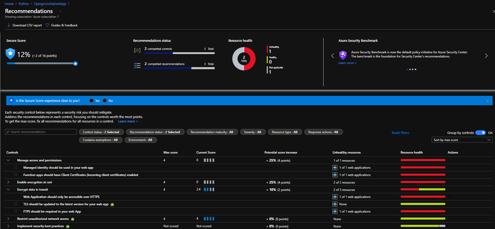
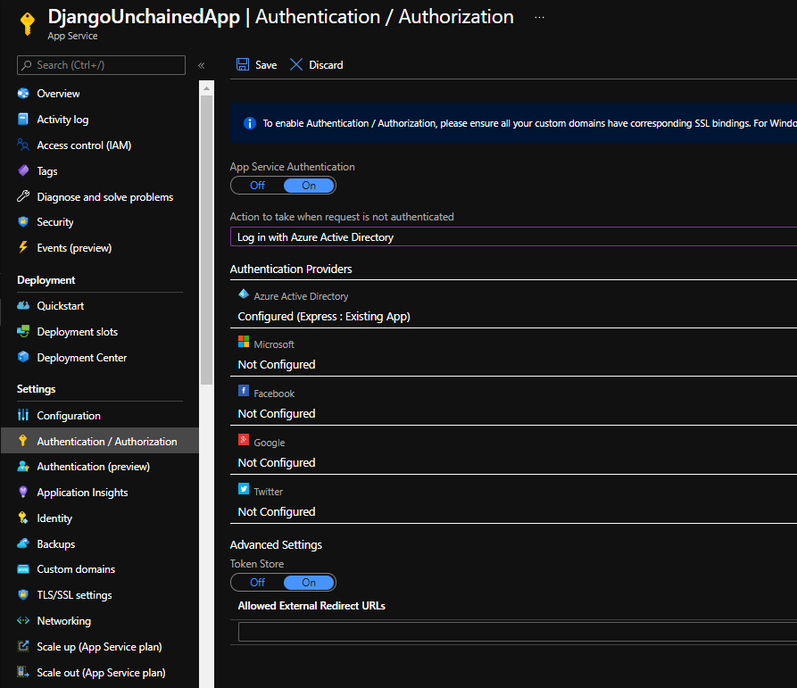
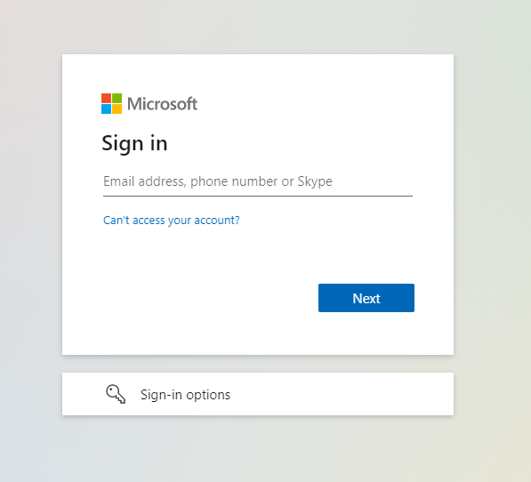
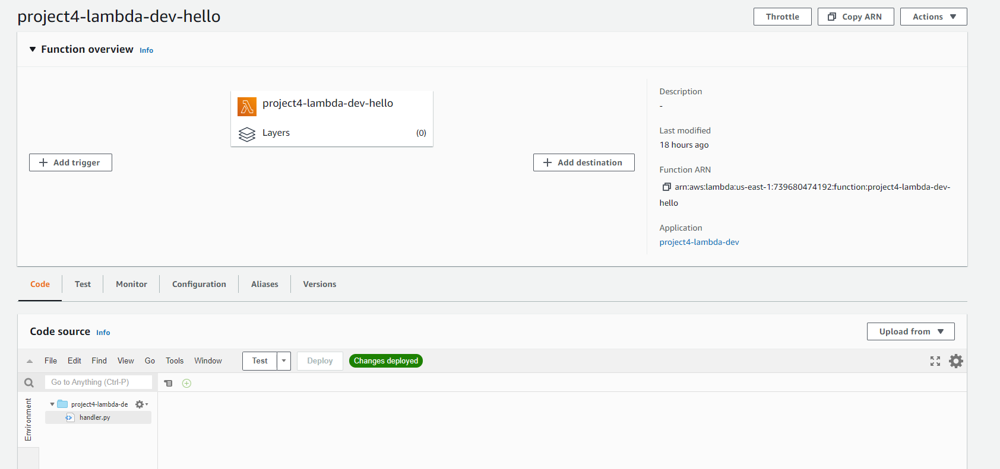
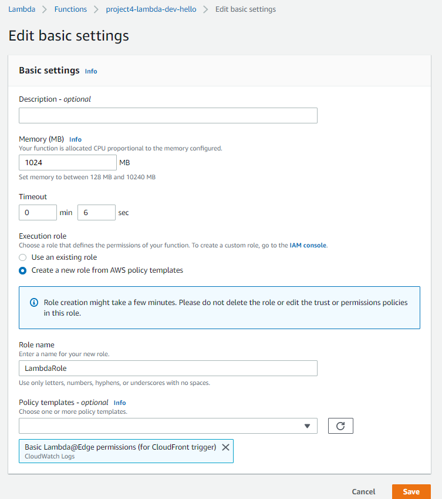

# Security for Serverless Apps

Both Azure and AWS offer security features to keep our serverless apps more secure.

## Azure

- Let's visit the App we created in the previous exercise. There, we'll click on **Security**, on the menu on the left. This will open the [Azure Security Center](https://docs.microsoft.com/en-us/azure/security-center/) pane.
- Azure Security Center is a unified infrastructure security management system.
- Security Center is natively integrated with App Service, eliminating the need for deployment and onboarding. The integration is transparent.
- In this pane, Security Center shows us the security recommendations and security alerts related to our App.
- If we click on the **View all recommendations in Security Center** button, we are taken to the Security Center page, where we can see all details related to security of our resources in Azure.

- Still in our App Service resource, we can go to **Authentication / Authorization**, under **Settings**. Here we can set authentication features, to prevent anonymous users to access our app. By activating this feature, users will be prompted to supply some sort of user identification in order to be able to access the app.
- If we enable **App Service Authentication**, we are presented with different authentication providers. For this lab, we'll configure **Azure Active Directory**. Like that, users will be prompted to enter their Azure AD credentials to access the App.

- We first need to configure the authentication provider, and then, under **Action to take when request is not authenticated**, select the authentication provider we wish to use.
- For Azure AD, the configuration is much easier, since we don't need to provide any further data. For the other providers, we'll need to provide the API key and the API secret, to allow Azure access to these providers.
- Now, when we visit our APP URL, we are prompted with a window where we should type our credentials.

- Another security aspect to be aware of is that of [managed identities](https://docs.microsoft.com/en-us/azure/active-directory/managed-identities-azure-resources/).
- There are two types of managed identity.
  - **System assigned**: Some Azure services (like this App Service, for instance) allow you to enable a managed identity directly on a service instance. When you enable a system-assigned managed identity an identity is created in Azure AD that is tied to the lifecycle of that service instance. So when the resource is deleted, Azure automatically deletes the identity for you. By design, **only that Azure resource can use this identity to request tokens from Azure AD**. It's a one-to-one relationship.
  - **User assigned**: You may also create a managed identity as a standalone Azure resource. You can create a user-assigned managed identity and assign it to one or more instances of an Azure service. In the case of user-assigned managed identities, the identity is managed separately from the resources that use it. It's a one-to-many relationship.
- For App Service, we can activate the system-assigned identity by moving the status slider to On. From this moment on, the App will be registered with Azure AD, and can be granted access to other resources protected by Azure AD.
- If we go to the User Assigned tab, we can simply add an existing identity by clicking on the **+ Add** button.

## AWS

- For Lambda Functions in AWS, we have the [Permissions](https://docs.aws.amazon.com/lambda/latest/dg/lambda-permissions.html) feature.
- We can use IAM to manage access to the Lambda API and its resources, or we can use **execution roles**.
- A Lambda function's execution role is an AWS Identity and Access Management (IAM) role that grants the function permission to access AWS services and resources. You provide this role when you create a function, and Lambda assumes the role when your function is invoked.
- To create an execution role, in the AWS Console we go to our Lambda Function, click on **Configuration** tab, then **Permissions**, from the menu on the left. My GUI is different than the one presented in Michael's lecture.

- We then click on **Edit**, in the **Execution role** field. We'll see this window, where we can choose an existing role or create a new one. When we create a new role, we can choose from a number of policy templates.

- This would be the equivalent of the managed identity in Azure.
