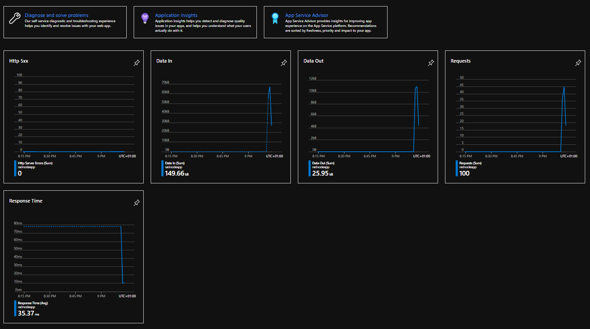
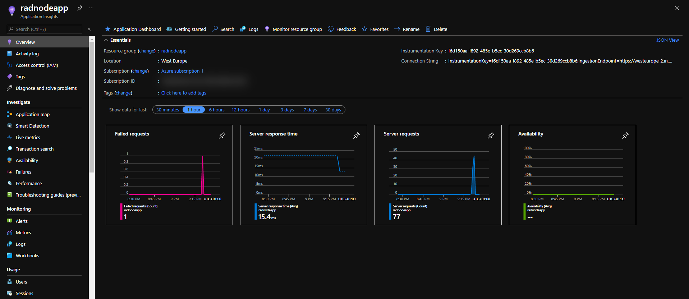
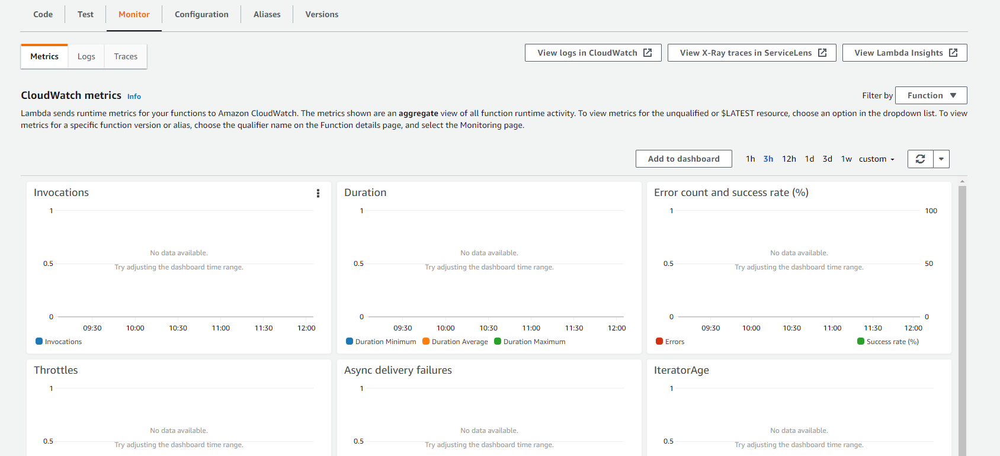

# Monitoring Serverless Apps in Azure and AWS

Azure and AWS offer a number of monitoring features for your serverless apps. Michael Levan shows us some of them in this lecture.

## Azure

- Right off the bat, in the overview pane of our App Service, we can see some information regarding our App's performance.
- When we scroll down, we can see 5 graphics: **Http 5xx**, **Data In**, **Data Out**, **Requests**, and **Response Time**.
- As users interact with our App, we can see how these graphics are updated.

- If we want a more detailed monitoring of our App, we can enable [Application Insights](https://docs.microsoft.com/en-us/azure/azure-monitor/app/app-insights-overview).
- Application Insights, a feature of Azure Monitor, is an extensible Application Performance Management (APM) service that can be used to monitor your live applications. It will automatically detect performance anomalies, and includes powerful analytics tools to help you diagnose issues and to understand what users actually do with your app.
- We can enable Application Insights for our App by going to the Application Insights section.
- Once enabled, this is what we'll see.

- Application Insights gives us the possibility to monitor our App's performance in real time, by going to the **Live metrics** section.
- In the App Service resource, we can access a few very useful monitoring tools, under the **Monitoring** section.
- A specially useful tool is the [App Service Diagnostics](https://docs.microsoft.com/en-us/azure/app-service/overview-diagnostics), whic can be accesed by clicking on **Diagnose and Solve Problems** on the menu on the left.

## AWS

- In AWS, we can monitor our Lambda Function's performance by going to the **Monitor** section. We'll see graphics similar to the ones presented in Azure Monitor.

