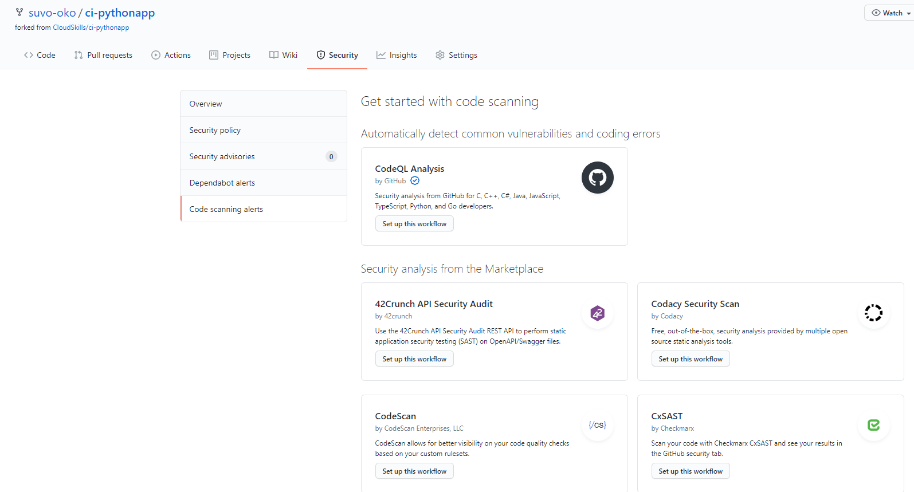
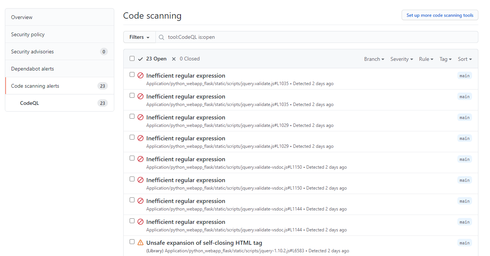

# Securing Code

For this lab, we'll see how we can secure our code using [GitHub's Code Scanning](https://docs.github.com/en/code-security/secure-coding) feature.

## Code Scanning

- Code scanning analyzes the code in a GitHub repository to find security vulnerabilities and coding errors.
- You can use code scanning to find, triage, and prioritize fixes for existing problems in your code.
- You can schedule scans for specific days and times, or trigger scans when a specific event occurs in the repository, such as a push.
- If code scanning finds a potential vulnerability or error in your code, GitHub displays an alert in the repository.
- This feature is free just for public repositories.

## The Project

- For this lab, we'll be using the [ci-pythonapp](https://github.com/suvo-oko/ci-pythonapp) repository, the same we used for a previous project.
- To set up Code Scanning, we go to the **Security** tab of our repo, and there, on the lower right corner, we click on **Set up code scanning**.
- In this page, we can choose from different security analysis workflows. We'll choose **CodeQL Analysis**, the default GitHub security analysis tool, by click on **Set up this workflow**.

- This will set up a new GitHub Actions workflow template. In this case, it generated a file called **codeql-analysis.yml**.
- GitHub automatically detects the languages in our repository, and generates the workflow accordingly.

```yaml
strategy:
      fail-fast: false
      matrix:
        language: [ 'javascript', 'python' ]
```

- When new code is pushed to the main branch, or whenever a contributor opens a pull request, the workflow will be triggered, and two jobs will run in parallel, one for JavaScript, and one for Pyton.
- When the workflow finishes, we can see the results of the analysis by clicking on the **Security** tab of our repo.
- We can click on each individual alert to see a breakdown of the cause of the alert.

