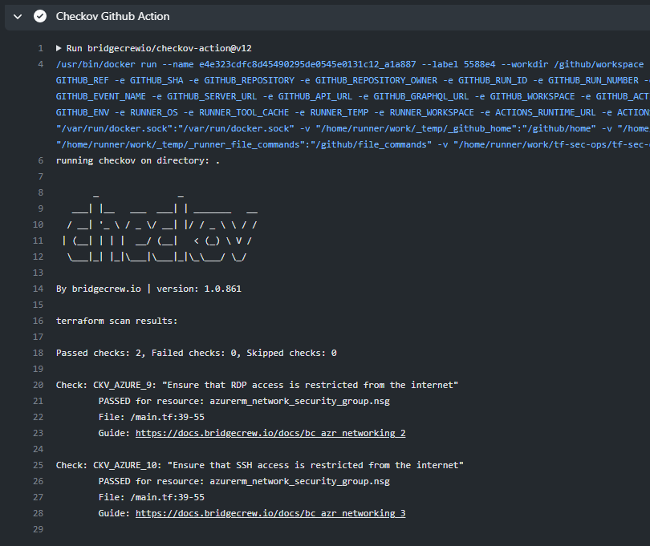
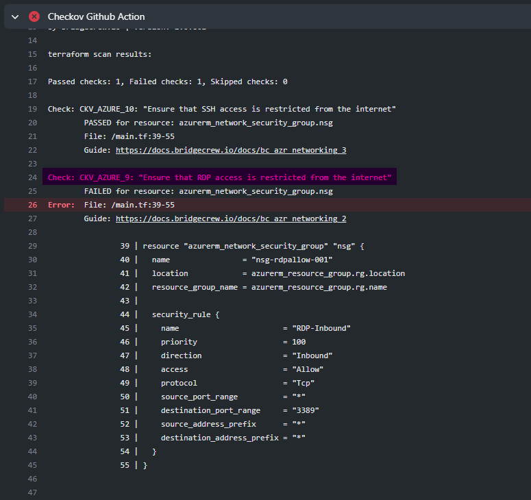

# Implementing Continuous Security

In this project, we'll integrate continuous security into an IaC CI pipeline. A security check will be performed for any new branch that is created in the repo.This will enforce security as the code is written.

## The Project

- We'll use the [tf-sec-ops](https://github.com/suvo-oko/tf-sec-ops) repo, which was forked from the [Cloudskills](https://github.com/cloudskills) GitHub account. This repo contains Terraform configuration files with instructions to deploy resources to Azure.
- We'll create a new GitHub Actions workflow file from scratch, and we'll use [Checkov](https://github.com/bridgecrewio/checkov), available from the marketplace. Checkov is a static code analysis tool for infrastructure-as-code. It scans cloud infrastructure provisioned using Terraform, Terraform plan, Cloudformation, Kubernetes, Serverless or ARM Templates and detects security and compliance misconfigurations.
- This is our workflow:

```yaml
name: CI

on:
  push:
    branches:
      - 'feature/*'
  workflow_dispatch

jobs:
  build:
    runs-on: ubuntu-latest

    steps:
      - uses: actions/checkout@v2
      
      - name: Checkov Github Action
        uses: bridgecrewio/checkov-action@v12
```

- When selecting the Checkov GitHub Action, make sure you choose version 12.
- This workflow has a manual trigger, indicated by **workflow_dispatch**.
- When we're done with the file, we'll move to the Actions tab and click on **Run this workflow**.
- The workflow will complete successfully! We can see that Checkov found no errors.

- We'll now clone the repository and make some changes to the Terraform code.
- In our main configuration file, we'll change the inbound rules for our network security group, allowing any IP address into our subnet. This security flaw should be detected by Checkov. Let's test it!

```terraform
resource "azurerm_network_security_group" "nsg" {
  name                = "nsg-rdpallow-001"
  location            = azurerm_resource_group.rg.location
  resource_group_name = azurerm_resource_group.rg.name

  security_rule {
    name                       = "RDP-Inbound"
    priority                   = 100
    direction                  = "Inbound"
    access                     = "Allow"
    protocol                   = "Tcp"
    source_port_range          = "*"
    destination_port_range     = "3389"
    source_address_prefix      = "*"  # this is the security hole
    destination_address_prefix = "*"
  }
}
```

- After committing and pushing the code back to our repo, the workflow starts, and we can see that Checkov caught the error.

- With this security monitoring feature, we can check security issues earlier in the process when writing the code, rather than later when infrastructure is already in production.
