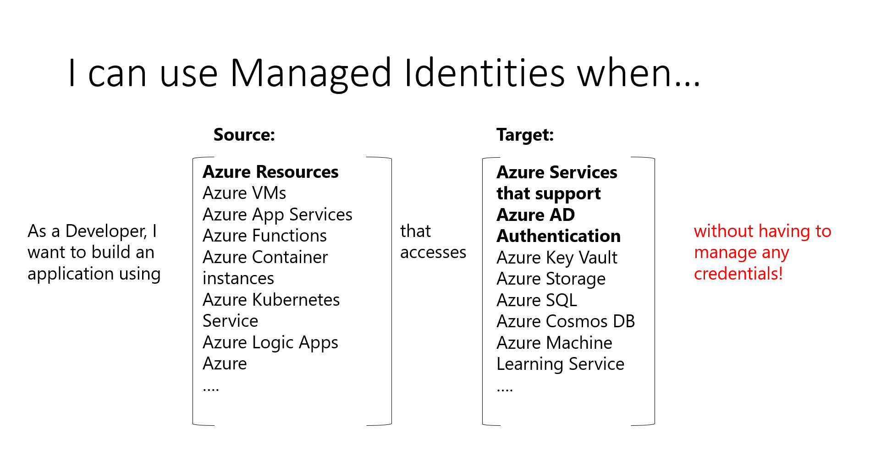
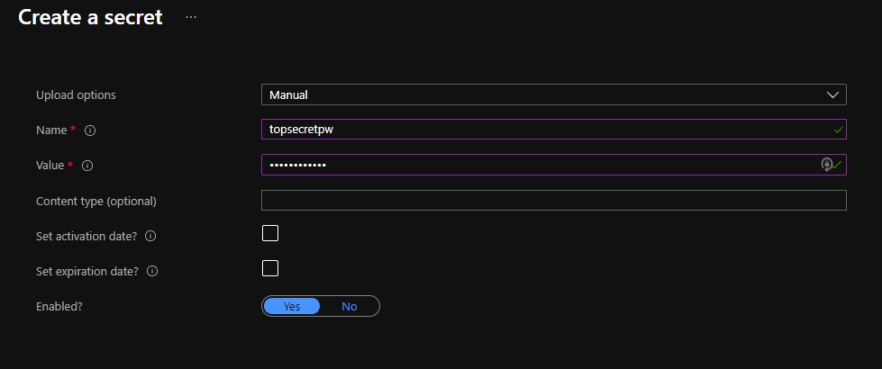
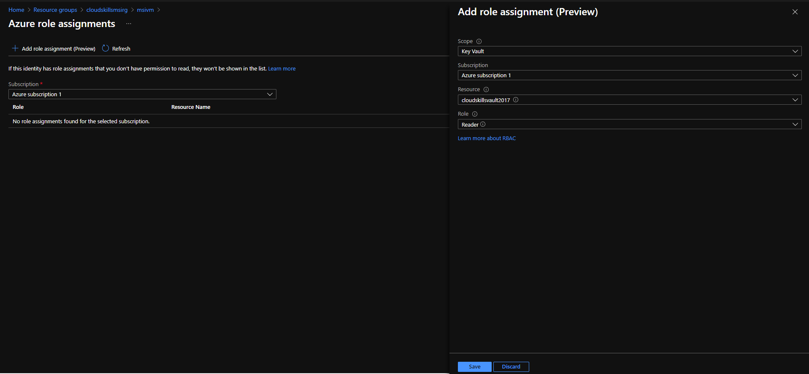
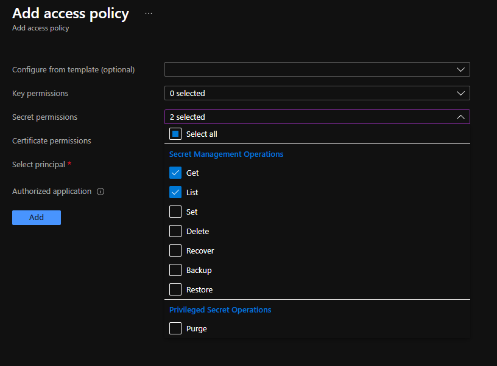
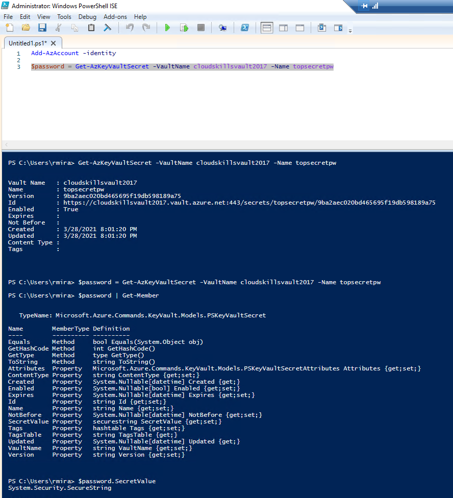

# Security Authentication in Code

In this lab, we'll use Azure's [Managed Service Identity](https://azure.microsoft.com/en-us/blog/keep-credentials-out-of-code-introducing-azure-ad-managed-service-identity/) feature to securely authenticate code. Managed identities for Azure resources are automatically managed by Azure and enable you to authenticate to services that support Azure AD authentication without needing to insert credentials into your code. Ideally, credentials should never appear in your code.

Our task for the lab is to have a virtual machine access secure information stored in Key Vault using a managed identity.

Check my notes for [Security for Serverless Apps](Week6/../../Week6/5_Security_Serverless.md) for more on managed identities.

This image from Microsoft Docs illustrates very well the uses of managed identities.

## The Project

- We'll first create a VM in the Azure portal. We'll use the **Windows Server 2019 Datacenter Gen 1** image.
- Once the VM is deployed, we'll create a Key Vault in the same resource group as the VM.
- Once the Key Vault is ready, we'll add a new secret, by clicking on **Secrets** on the left menu, and then on **+ Generate/Import**.

- We'll now assign a managed service identity to the VM we created above, which will be used to access the secret stored in the Key Vault.
- Back to the VM, we'll go to **Identity**, and we'll activate the **System assigned identity**. This identity is tied to this specific resource. Only this resource can use the identity, and once the resource is destroyed, the identity ceases to exist.
- We'll now add a role assignment to this identity. For our lab, the scope for this role assignment will be **Key Vault** and the role will be the one of **Reader**.

- Back to the VM's main page, we'll go to **Access policies**, under the **Settings** sections. Here we'll add a new access policy with the **Get** and **List** secret permissions, and we'll select the VM as the principal. By doing this, we'll allow this managed service identity to retrieve secrets from our Key Vault.

- We'll RDP into our VM using the credentials we set up in the first step, and once inside, we'll open a PowerShell session and install the AZ PowerShell module. This module will allow us to communicate with Azure via PowerShell.
- The command to install the AZ module is `Install-Module AZ`.
- We'll now run a few PowerShell commands:
  1. `Add-AzAccount -Identity` : this will connect to Azure using our Managed Service Identity. Just as a side-note, in the Microsoft documentation of Azure PowerShell, this command is listed as `Connect-AzAccount -Identity`.
  2. `$password = Get-AzKeyVaultSecret -VaultName cloudskillsvault2017 -Name topsecretpw` : this will pull down the secret from the Key Vault. We set this to a variable so it can be used later in the script.
  3. `$password | Get-Member` : the `Get-Member` cmdlet gets the properties and methods of an object. This cmdlet's output shows the `SecretValue` property, which is the one that contains the secret.
  4. `$password.SecretValue` : this is the cmdlet we can use in our PowerShell scripts when we need to pass secrets.

