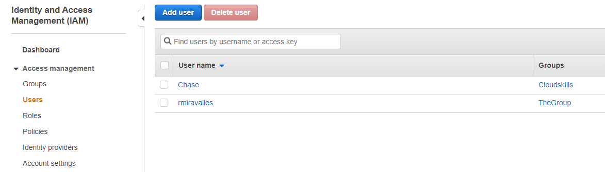
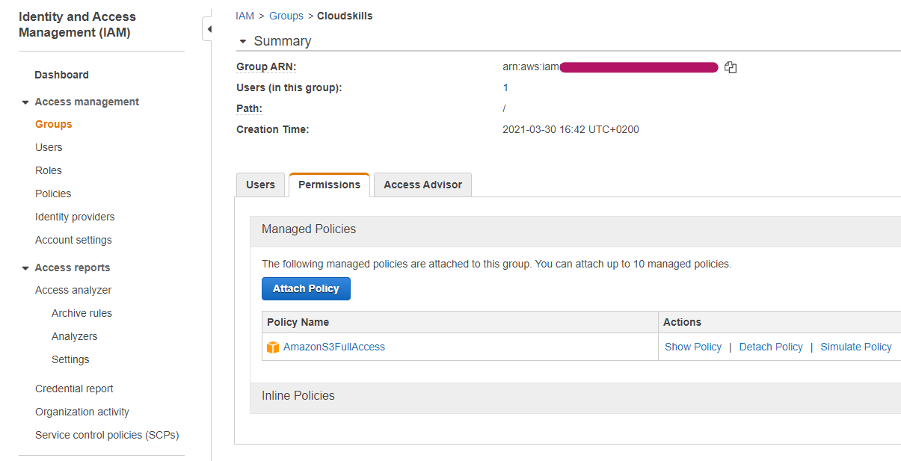
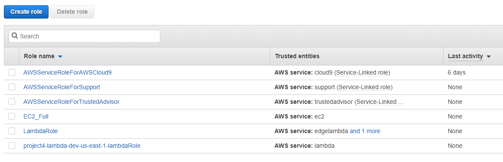

# Creating IAM Roles, Users and Groups

In this lab we'll learn how to create users and groups, and how to add users to groups in AWS. We'll also assign roles.

## The Project

- To create a new user using the CLI, we run the following command: `aws iam create-user --user-name User`.
- To create a new group using the CLI, we run `aws iam create-group --group-name Group`.
- To add a user to a group: `aws iam add-user-to-group --user-name User --group-name Group`.
- If we go to the console, then to IAM, and click on Users, we'll see our newly created user. Mine is called Chase.

- A newly created group has no permissions attached to it. To attach permissions to a group, we go to **Attach Policy** and choose from a list. We can attach up to 10 managed policies.

### Roles

- An IAM role is an IAM identity that you can create in your account that has specific permissions. An IAM role is similar to an IAM user, in that it is an AWS identity with permission policies that determine what the identity can and cannot do in AWS.
- To create a role, we go to roles, then **Create role** and from there, we can choose from a number of common use cases.
- For this lab, we'll choose EC2, and attach the **AmazonEC2FullAccess** built-in policy.
- From now on, all EC2 instances with this role attached will have full access to EC2.

