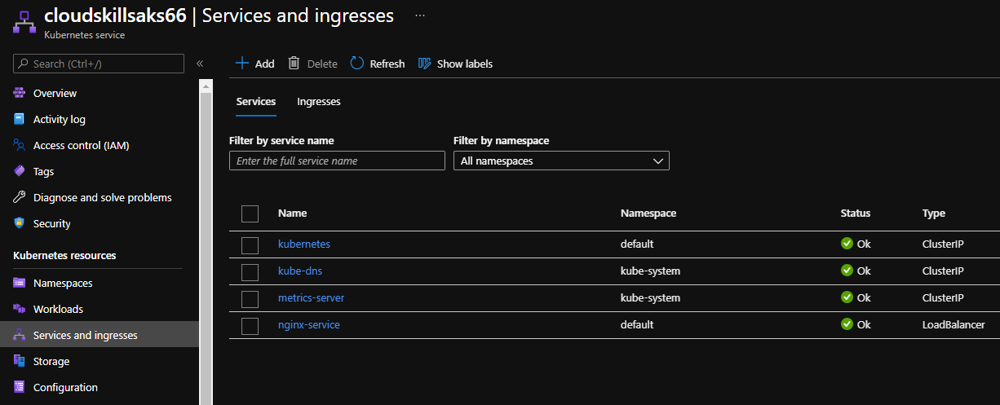
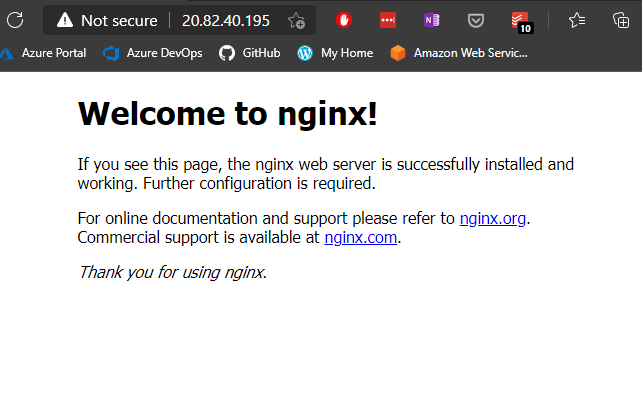

# Deploying to AKS

In this project we'll deploy an NGINX application to the Kubernetes cluster we created in the previous exercise.

## The Project

- We'll use [this Kubernetes manifest file](Project3/nginx_aks.yml) to deploy our service.
- To create the resource from the manifest file, we run `kubectl create -f nginx_aks.yml`.
- The `-f` flag stands for filename.
- To see our deployments, we run `kubectl get deployments`.
- To see our running services, we type `kubectl get service`.
- To see our services running from the Azure portal, we go to our AKS resource, then to **Services and ingresses**, from the left menu.

- To visit our application, we click on the service name. In this page, we can find the external IP address.

